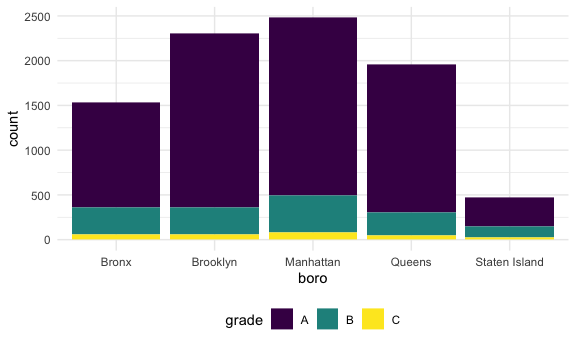
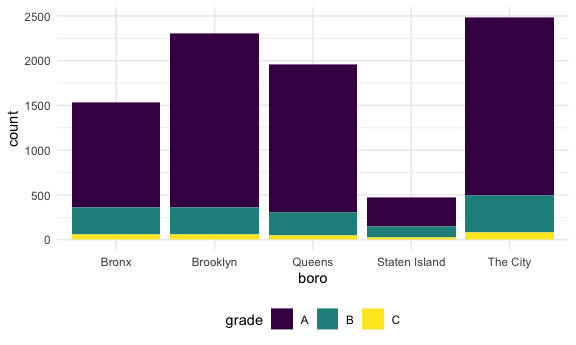
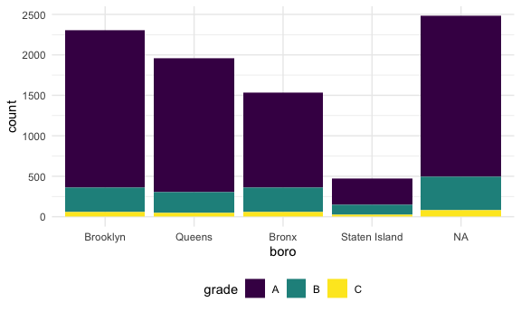
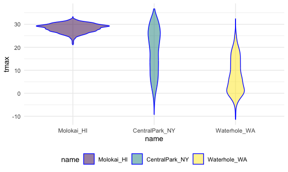
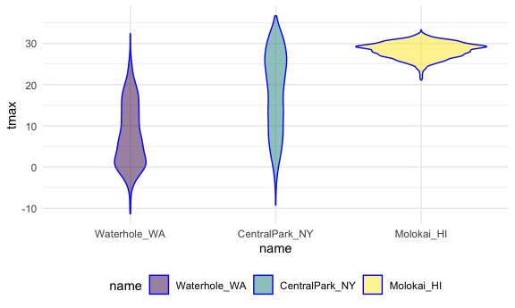
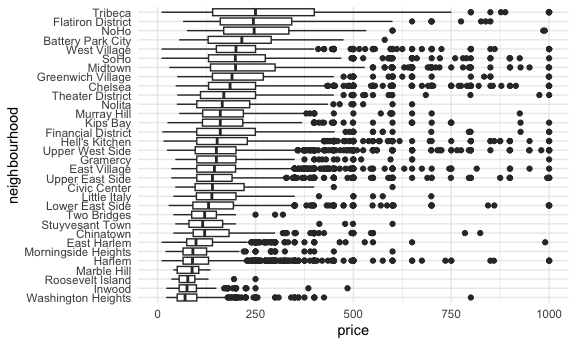

strings_and_factors
================

``` r
library(tidyverse)
```

    ## ── Attaching core tidyverse packages ──────────────────────── tidyverse 2.0.0 ──
    ## ✔ dplyr     1.1.3     ✔ readr     2.1.4
    ## ✔ forcats   1.0.0     ✔ stringr   1.5.0
    ## ✔ ggplot2   3.4.3     ✔ tibble    3.2.1
    ## ✔ lubridate 1.9.2     ✔ tidyr     1.3.0
    ## ✔ purrr     1.0.2     
    ## ── Conflicts ────────────────────────────────────────── tidyverse_conflicts() ──
    ## ✖ dplyr::filter() masks stats::filter()
    ## ✖ dplyr::lag()    masks stats::lag()
    ## ℹ Use the conflicted package (<http://conflicted.r-lib.org/>) to force all conflicts to become errors

``` r
library(rvest)
```

    ## 
    ## Attaching package: 'rvest'
    ## 
    ## The following object is masked from 'package:readr':
    ## 
    ##     guess_encoding

``` r
library(p8105.datasets)
knitr::opts_chunk$set(
  fig.width = 6,
  fig.asp = .6,
  out.width = "90%"
)

theme_set(theme_minimal() + theme(legend.position = "bottom"))

options(
  ggplot2.continuous.colour = "viridis",
  ggplot2.continuous.fill = "viridis"
)

scale_colour_discrete = scale_colour_viridis_d
scale_fill_discrete = scale_fill_viridis_d
```

# Strings and regex

``` r
string_vec = c("my", "name", "is", "irene")

str_detect(string_vec, "irene")
```

    ## [1] FALSE FALSE FALSE  TRUE

``` r
str_replace(string_vec, "irene", "Irene")
```

    ## [1] "my"    "name"  "is"    "Irene"

## Designating matches at the beginning or end of a line

``` r
string_vec = c(
  "i think we all rule for participating",
  "i think i have been caught",
  "i think this will be quite fun actually",
  "it will be fun, i think"
  )

str_detect(string_vec, "^i think")
```

    ## [1]  TRUE  TRUE  TRUE FALSE

``` r
str_detect(string_vec, "i think$")
```

    ## [1] FALSE FALSE FALSE  TRUE

## Designating a list of characters that will count as a match

``` r
string_vec = c(
  "Time for a Pumpkin Spice Latte!",
  "went to the #pumpkinpatch last weekend",
  "Pumpkin Pie is obviously the best pie",
  "SMASHING PUMPKINS -- LIVE IN CONCERT!!"
  )

str_detect(string_vec,"[Pp]umpkin")
```

    ## [1]  TRUE  TRUE  TRUE FALSE

## Providing a range of letters or numbers that count as a match

``` r
string_vec = c(
  '7th inning stretch',
  '1st half soon to begin. Texas won the toss.',
  'she is 5 feet 4 inches tall',
  '3AM - cant sleep :('
  )

str_detect(string_vec, "^[0-9][a-zA-Z]")
```

    ## [1]  TRUE  TRUE FALSE  TRUE

## `.` matches anything

``` r
string_vec = c(
  'Its 7:11 in the evening',
  'want to go to 7-11?',
  'my flight is AA711',
  'NetBios: scanning ip 203.167.114.66'
  )

str_detect(string_vec, "7.11")
```

    ## [1]  TRUE  TRUE FALSE  TRUE

## Special characters

``` r
string_vec = c(
  'The CI is [2, 5]',
  ':-]',
  ':-[',
  'I found the answer on pages [6-7]'
  )

str_detect(string_vec, "\\[")
```

    ## [1]  TRUE FALSE  TRUE  TRUE

# Thoughts on factors

## Coersion and potential issues with factors

``` r
vec_sex = factor(c("male", "male", "female", "female"))
vec_sex
```

    ## [1] male   male   female female
    ## Levels: female male

``` r
as.numeric(vec_sex)
```

    ## [1] 2 2 1 1

``` r
vec_sex = fct_relevel(vec_sex, "male")
vec_sex
```

    ## [1] male   male   female female
    ## Levels: male female

``` r
as.numeric(vec_sex)
```

    ## [1] 1 1 2 2

# NSDUH

``` r
nsduh_url = "http://samhda.s3-us-gov-west-1.amazonaws.com/s3fs-public/field-uploads/2k15StateFiles/NSDUHsaeShortTermCHG2015.htm"

table_marj = 
  read_html(nsduh_url) |> 
  html_table() |> 
  first() |>
  slice(-1)
```

``` r
data_marj = 
  table_marj |>
  select(-contains("P Value")) |>
  pivot_longer(
    -State,
    names_to = "age_year", 
    values_to = "percent") |>
  separate(age_year, into = c("age", "year"), sep = "\\(") |>
  mutate(
    year = str_replace(year, "\\)", ""),
    percent = str_replace(percent, "[a-c]$", ""),
    percent = as.numeric(percent)) |>
  filter(!(State %in% c("Total U.S.", "Northeast", "Midwest", "South", "West")))
```

## Visualizing data for 12-17 age group

``` r
data_marj |>
  filter(age == "12-17") |> 
  mutate(State = fct_reorder(State, percent)) |> 
  ggplot(aes(x = State, y = percent, color = year)) + 
    geom_point() + 
    theme(axis.text.x = element_text(angle = 90, hjust = 1))
```


# Restaurant inspections

``` r
data("rest_inspec")

rest_inspec |> 
  group_by(boro, grade) |> 
  summarize(n = n()) |> 
  pivot_wider(names_from = grade, values_from = n)
```

    ## `summarise()` has grouped output by 'boro'. You can override using the
    ## `.groups` argument.

    ## # A tibble: 6 × 8
    ## # Groups:   boro [6]
    ##   boro              A     B     C `Not Yet Graded`     P     Z  `NA`
    ##   <chr>         <int> <int> <int>            <int> <int> <int> <int>
    ## 1 BRONX         13688  2801   701              200   163   351 16833
    ## 2 BROOKLYN      37449  6651  1684              702   416   977 51930
    ## 3 MANHATTAN     61608 10532  2689              765   508  1237 80615
    ## 4 Missing           4    NA    NA               NA    NA    NA    13
    ## 5 QUEENS        35952  6492  1593              604   331   913 45816
    ## 6 STATEN ISLAND  5215   933   207               85    47   149  6730

``` r
rest_inspec =
  rest_inspec |>
  filter(grade %in% c("A", "B", "C"), boro != "Missing") |> 
  mutate(boro = str_to_title(boro))
```

## Pizza places, grades by borough

``` r
rest_inspec |> 
  filter(str_detect(dba, "Pizza")) |> 
  group_by(boro, grade) |> 
  summarize(n = n()) |> 
  pivot_wider(names_from = grade, values_from = n)
```

    ## `summarise()` has grouped output by 'boro'. You can override using the
    ## `.groups` argument.

    ## # A tibble: 5 × 3
    ## # Groups:   boro [5]
    ##   boro              A     B
    ##   <chr>         <int> <int>
    ## 1 Bronx             9     3
    ## 2 Brooklyn          6    NA
    ## 3 Manhattan        26     8
    ## 4 Queens           17    NA
    ## 5 Staten Island     5    NA

## Visualize table

``` r
rest_inspec |> 
  filter(str_detect(dba, "[Pp][Ii][Zz][Zz][Aa]")) |>
  ggplot(aes(x = boro, fill = grade)) + 
  geom_bar() 
```



## Have things ordered by number of pizza places using `fct_infreq`

``` r
rest_inspec |> 
  filter(str_detect(dba, "[Pp][Ii][Zz][Zz][Aa]")) |>
  mutate(boro = fct_infreq(boro)) |>
  ggplot(aes(x = boro, fill = grade)) + 
  geom_bar()
```


## Rename a borough using `str_replace`

``` r
rest_inspec |> 
  filter(str_detect(dba, "[Pp][Ii][Zz][Zz][Aa]")) |>
  mutate(
    boro = fct_infreq(boro),
    boro = str_replace(boro, "Manhattan", "The City")) |>
  ggplot(aes(x = boro, fill = grade)) + 
  geom_bar()
```



## Use `replace`

``` r
rest_inspec |> 
  filter(str_detect(dba, "[Pp][Ii][Zz][Zz][Aa]")) |>
  mutate(
    boro = fct_infreq(boro),
    boro = replace(boro, which(boro == "Manhattan"), "The City")) |>
  ggplot(aes(x = boro, fill = grade)) + 
  geom_bar()
```

    ## Warning: There was 1 warning in `mutate()`.
    ## ℹ In argument: `boro = replace(boro, which(boro == "Manhattan"), "The City")`.
    ## Caused by warning in `[<-.factor`:
    ## ! invalid factor level, NA generated



This doesn’t work. Factors have very specific values, so trying to use a
value that isn’t an existing factor level won’t work.

## Rename factor levels using `fct_recode`

``` r
rest_inspec |> 
  filter(str_detect(dba, regex("pizza", ignore_case = TRUE))) |>
  mutate(
    boro = fct_infreq(boro),
    boro = fct_recode(boro, "The City" = "Manhattan")) |>
  ggplot(aes(x = boro, fill = grade)) + 
  geom_bar()
```


# Weather data

``` r
weather_df = 
  rnoaa::meteo_pull_monitors(
    c("USW00094728", "USW00022534", "USS0023B17S"),
    var = c("PRCP", "TMIN", "TMAX"), 
    date_min = "2021-01-01",
    date_max = "2023-12-31") |>
  mutate(
    name = recode(
      id, 
      USW00094728 = "CentralPark_NY", 
      USW00022534 = "Molokai_HI",
      USS0023B17S = "Waterhole_WA"),
    tmin = tmin / 10,
    tmax = tmax / 10) |>
  select(name, id, everything())
```

    ## Registered S3 method overwritten by 'hoardr':
    ##   method           from
    ##   print.cache_info httr

    ## using cached file: /Users/irenecho/Library/Caches/org.R-project.R/R/rnoaa/noaa_ghcnd/USW00094728.dly

    ## date created (size, mb): 2023-09-28 10:20:05.358275 (8.524)

    ## file min/max dates: 1869-01-01 / 2023-09-30

    ## using cached file: /Users/irenecho/Library/Caches/org.R-project.R/R/rnoaa/noaa_ghcnd/USW00022534.dly

    ## date created (size, mb): 2023-09-28 10:20:10.51322 (3.83)

    ## file min/max dates: 1949-10-01 / 2023-09-30

    ## using cached file: /Users/irenecho/Library/Caches/org.R-project.R/R/rnoaa/noaa_ghcnd/USS0023B17S.dly

    ## date created (size, mb): 2023-09-28 10:20:12.329849 (0.994)

    ## file min/max dates: 1999-09-01 / 2023-09-30

``` r
weather_df |>
  mutate(name = forcats::fct_relevel(name, c("Molokai_HI", "CentralPark_NY", "Waterhole_WA"))) |> 
  ggplot(aes(x = name, y = tmax)) + 
  geom_violin(aes(fill = name), color = "blue", alpha = .5) + 
  theme(legend.position = "bottom")
```

    ## Warning: Removed 33 rows containing non-finite values (`stat_ydensity()`).



## Use `fct_reorder`

``` r
weather_df |>
  mutate(name = forcats::fct_reorder(name, tmax)) |> 
  ggplot(aes(x = name, y = tmax)) + 
  geom_violin(aes(fill = name), color = "blue", alpha = .5) + 
  theme(legend.position = "bottom")
```

    ## Warning: There was 1 warning in `mutate()`.
    ## ℹ In argument: `name = forcats::fct_reorder(name, tmax)`.
    ## Caused by warning:
    ## ! `fct_reorder()` removing 33 missing values.
    ## ℹ Use `.na_rm = TRUE` to silence this message.
    ## ℹ Use `.na_rm = FALSE` to preserve NAs.

    ## Warning: Removed 33 rows containing non-finite values (`stat_ydensity()`).



``` r
weather_df |>
  lm(tmax ~ name, data = _)
```

    ## 
    ## Call:
    ## lm(formula = tmax ~ name, data = weather_df)
    ## 
    ## Coefficients:
    ##      (Intercept)    nameMolokai_HI  nameWaterhole_WA  
    ##            18.26             10.11            -10.51

``` r
weather_df |>
  mutate(name = forcats::fct_relevel(name, c("Molokai_HI", "CentralPark_NY", "Waterhole_WA"))) |> 
  lm(tmax ~ name, data = _)
```

    ## 
    ## Call:
    ## lm(formula = tmax ~ name, data = mutate(weather_df, name = forcats::fct_relevel(name, 
    ##     c("Molokai_HI", "CentralPark_NY", "Waterhole_WA"))))
    ## 
    ## Coefficients:
    ##        (Intercept)  nameCentralPark_NY    nameWaterhole_WA  
    ##              28.37              -10.11              -20.63

# PULSE data

``` r
pulse_data = 
  haven::read_sas("./data/public_pulse_data.sas7bdat") |>
  janitor::clean_names() |>
  pivot_longer(
    bdi_score_bl:bdi_score_12m,
    names_to = "visit", 
    names_prefix = "bdi_score_",
    values_to = "bdi") |>
  select(id, visit, everything()) |>
  mutate(
    visit = str_replace(visit, "bl", "00m"),
    visit = factor(visit)) |>
  arrange(id, visit)

print(pulse_data, n = 12)
```

    ## # A tibble: 4,348 × 5
    ##       id visit   age sex     bdi
    ##    <dbl> <fct> <dbl> <chr> <dbl>
    ##  1 10003 00m    48.0 male      7
    ##  2 10003 01m    48.0 male      1
    ##  3 10003 06m    48.0 male      2
    ##  4 10003 12m    48.0 male      0
    ##  5 10015 00m    72.5 male      6
    ##  6 10015 01m    72.5 male     NA
    ##  7 10015 06m    72.5 male     NA
    ##  8 10015 12m    72.5 male     NA
    ##  9 10022 00m    58.5 male     14
    ## 10 10022 01m    58.5 male      3
    ## 11 10022 06m    58.5 male      8
    ## 12 10022 12m    58.5 male     NA
    ## # ℹ 4,336 more rows

# Airbnb

``` r
data("nyc_airbnb")

nyc_airbnb |>
  filter(neighbourhood_group == "Manhattan") |> 
  mutate(
    neighbourhood = fct_reorder(neighbourhood, price)) |> 
  ggplot(aes(x = neighbourhood, y = price)) +
  geom_boxplot() +
  coord_flip() + 
  ylim(0, 1000)
```

    ## Warning: Removed 109 rows containing non-finite values (`stat_boxplot()`).


